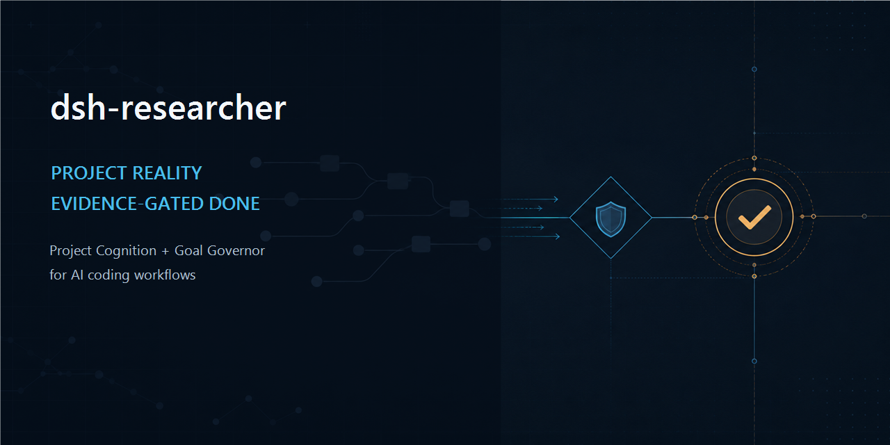
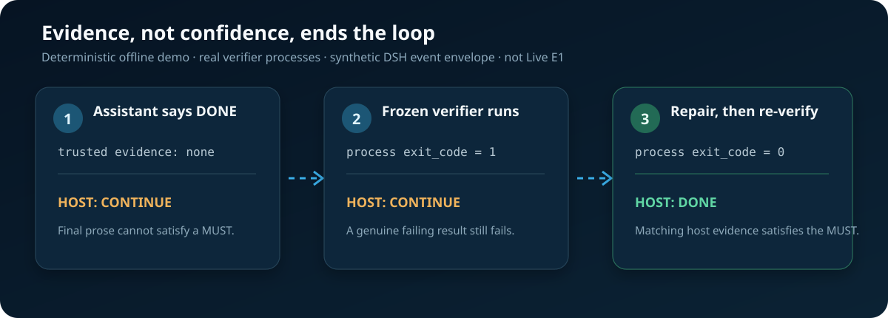

# dsh-researcher

**English** | [简体中文](./README.zh-CN.md)

[](https://github.com/TLNing260310/dsh-researcher/actions/workflows/test.yml)
[](https://github.com/TLNing260310/dsh-researcher/releases)
[](./LICENSE)
[](./docs/validation-status.md)



## Stop AI coding agents from forgetting project reality—or declaring DONE without evidence

`dsh-researcher` is an experimental governance layer for [DeepSeek Harness](https://github.com/deepseek-ai/deepseek-harness). It separates two jobs that ordinary Plan mode tends to mix:

- **Project Research** reconstructs purpose, architecture, constraints, risks, and unknowns inside a guarded read-only session.
- **Goal Governor** freezes the target, boundaries, budget, human gates, and definition of done; the host then derives the terminal state from trusted events instead of assistant prose.

They are independent. You can trial Project Research without adopting Goal Contracts.

> **Honest maturity:** the mechanisms, installer lifecycle, adversarial replay, and offline E1 infrastructure are tested. A complete v1.5 live attempt ran but was **INVALID**; E1 conformance, net productivity gain, long-term Project Cognition value, and adapters beyond DSH remain **not proven**.

> **Latest runtime evidence:** protocol v1.5 ran all six official `deepseek-v4-flash` tracks but scored `1 PASS / 4 FAIL / 1 INVALID`. v1.6 and v1.7 exposed two read-your-write defects. v1.8 derived the correct `DONE`, but Flash stopped after the mutation response and never called the formal decision tool, so the host complete count remained zero and `simple-done` was a causally valid FAIL. All old results remain frozen. Protocol v1.9 makes mutation responses progress-only and is offline-ready, but has not run live. See the [v1.5 result](./docs/evidence/e1-v1.5-live-results.md), [v1.6 result](./docs/evidence/e1-v1.6-live-results.md), [v1.7 result](./docs/evidence/e1-v1.7-live-results.md), [v1.8 result](./docs/evidence/e1-v1.8-live-results.md), and current frozen protocol.

## The problem

AI coding becomes unreliable across sessions, not only within one prompt:

1. A new session re-guesses why the repository exists.
2. Locally plausible changes slowly cross architecture or migration boundaries.
3. An agent says “done” without sufficient outcome evidence—or keeps polishing after the task is already satisfied.
4. The person never froze a stopping condition, so neither side knows when to stop.

A Plan says what steps may be attempted. This project records what is believed true, what must be achieved, who may prove it, and when work must stop.

## See the mechanism in 60 seconds

The public demo is offline and starts real verifier child processes. It uses a synthetic DSH-shaped event envelope, so it proves reducer behavior—not Live DSH or model productivity.

```bash
git clone https://github.com/TLNing260310/dsh-researcher.git
cd dsh-researcher
npm run demo
```



The three decisions are reproducible:

```text
assistant says DONE, no trusted evidence  → CONTINUE
matching verifier exits 1                → CONTINUE
matching verifier exits 0 after repair   → DONE
```

The final assistant message is never evidence. A MUST criterion is satisfied only by a host event bound to an approved verifier's tool name, complete arguments, argument hash, and result policy.

## Choose only the layer you need

| Your situation | Use | Maturity |
|---|---|---|
| Taking over an unfamiliar repository or checking architecture before a risky change | **Project Research** | Isolated trial; read-only runtime boundary has a real DSH Web smoke |
| Checking one project fact during coding | `/researcher <question>` in Governed Coding | Isolated one-turn trial |
| Freezing acceptance criteria, budgets, human gates, and stopping states | **Goal Governor** | Advanced alpha; mechanisms tested, outcome gain unproven |
| A tiny bug, CRUD change, or disposable script | Ordinary Agent / Plan | This project is probably too heavy |
| Codex, Claude Code, OpenClaw, Kiro, or Zed/Zcode without DSH | Do not install yet | Portable core exists; client adapters are not delivered |

## Safe trial on DeepSeek Harness

Requirements:

- DeepSeek Harness target: `0.1.1-rc.2`; offline infrastructure is green, while the isolated Gate 0/live conformance result remains pending.
- DSH runtime Node requirement: `^22.19.0 || >=24.0.0` (the portable project core remains `>=22.12.0`).
- Node.js: `>=22.12.0`.
- Use an isolated `DSH_HOME` and a non-critical repository copy first.

This repository is **GitHub-distributed only**. The unscoped npm name `dsh-researcher` belongs to a different maintainer and repository. Do not use `npm install dsh-researcher`; use the pinned GitHub source or signed release assets below. The private scoped identity `@tlning260310/dsh-researcher` prevents accidental publication under the wrong identity; this is a DSH preset bundle plus Node governance library, not a native marketplace-plugin claim.

Preview every installer-owned change first:

```bash
npx -y github:TLNing260310/dsh-researcher#v0.8.0-alpha.9 --dry-run
```

Install only after reviewing the preview:

```bash
npx -y github:TLNing260310/dsh-researcher#v0.8.0-alpha.9
```

The installer refuses unknown DSH versions and existing presets by default. Backup, force-upgrade, uninstall, rollback, and SHA-256-bound release installation are documented in [Safe installation and recovery](./docs/installation.md).

## Path A: read-only Project Research

1. Start a new DSH Web session and select `Read Only`.
2. Select `项目研究 Project Research`. The preset tightens approval to `never`.
3. Ask a bounded, evidence-oriented question:

```text
Run research_doctor first. Review this repository without writing files.
Use path:line evidence to explain its purpose, immutable constraints,
documentation/implementation conflicts, and the next hypothesis worth testing.
Mark anything unverified as UNKNOWN.
```

`research_doctor` must be the first tool call. Research remains locked unless the Runtime Certificate is `SAFE`; later permission drift revokes the certificate before another model response.

Two entry points exist:

| Entry | Lifetime | Intended use |
|---|---|---|
| `项目研究 Project Research` preset | Persistent session; environment-level read-only, approval never, no generic shell | Full or high-risk repository research |
| `/researcher <question>` | One guarded read-only turn inside Governed Coding | A focused fact check during implementation |

The real smoke proves the runtime boundary, not report quality. Two local 14B probes failed to produce a publishable report; that negative evidence remains public in [Project Research local-output smoke](./docs/evidence/project-research-local-output-smoke-2026-08-25.md).

## Path B: a review-first Goal Contract

The Quickstart generates external Cognition, Verifier Registry, Goal Contract, and `REVIEW.md` drafts. It does not approve a goal or promote project facts for you.

```bash
npx -y --package=github:TLNing260310/dsh-researcher#v0.8.0-alpha.9 project-cognition init .
npx -y --package=github:TLNing260310/dsh-researcher#v0.8.0-alpha.9 project-cognition quickstart --root . --out ../my-goal-review --goal-id fix-login-timeout
```

Review purpose, boundaries, MUST criteria, budget, and verifier definitions in the generated `REVIEW.md`, then follow its explicit approval commands. See the [five-minute Quickstart](./docs/quickstart.md).

## What “done” means here

- Every MUST criterion needs a frozen verifier or direct human gate.
- The final attempt re-proves every MUST; it cannot inherit an old attempt's success.
- An already-passing baseline returns `ALREADY_SATISFIED` without a performative code change.
- Attempt, time, token, or no-progress budgets end in `STOPPED`.
- Contract, cognition, permission, or verifier drift ends in `NEEDS_HUMAN`.
- A model cannot write or replace its own terminal decision; the host recomputes it from the trusted event prefix.

## Authority flow

```text
read-only research
  → Research Session Ledger (non-authoritative)
  → draft revision
  → owner review
  → seal
  → .project-cognition/state.json (canonical truth)
  → deterministic PROJECT_COGNITION.md projection

Goal Contract + frozen verifier registry
  → host-observed calls, results, gates, usage, and repository revision
  → replay / reducer
  → CONTINUE | NEEDS_HUMAN | DONE | STOPPED
```

The CLI actor label is not human authentication. Repository governance must keep approval authority outside the model workflow.

## Evidence ledger

| Layer | Status | What it establishes |
|---|---|---|
| Unit, replay, integration, adversarial, installer, and package tests | PASS | The published mechanisms reject the covered drift and forged-evidence paths |
| `project-cognition doctor .` | PASS | Current schema, hashes, projection, goals, and registry agree; it does not prove evidence freshness |
| DSH Web Project Research smoke | Runtime boundary PASS; output probes FAIL | The exact tested runtime can become SAFE and reject drift; research quality is not established |
| Goal Governor E1 infrastructure | v1.9 offline READY; v1.5 and incomplete v1.6-v1.8 Live E1 INVALID | Negative evidence is preserved; preflight, layered budgets, workspace binding, run lock, cost admission, bundle, replay, progress-only mutation feedback, and scorer exist |
| Outcome value and portability | NOT PROVEN | Requires Live E1, a non-inferential pilot, E2, then second-adapter conformance |

Run the public offline checks without a model or network call:

```bash
npm run check
npm run demo
npm run eval:e1:preflight
```

The proof order is frozen as `Gate 0 → E1 → non-inferential pilot → E2 → second-adapter conformance → E3`. See [Validation Status](./docs/validation-status.md) and the protocol-owned [Goal Governor evaluation definition](./docs/goal-governor-evaluation-protocol.md).

Client integrations share the [portable HostEvent and invocation contract](./docs/client-adapter-contract.md): one-shot `researcher.ask(...)`, persistent `researcher.mode.set/get(...)`, and client-native mode-switch commands reduce to the same host-owned state. The package root exposes `adapterCore` for this experimental base envelope; it is not a governed-adapter conformance claim.

## How this differs from familiar tools

| Layer | Primary question |
|---|---|
| Plan / Tasks | What steps should we attempt next? |
| Spec | What behavior do we intend to build or change? |
| Memory | What did the agent previously learn? |
| Project Cognition | What claims about repository reality are trusted, why, and when do they become stale? |
| Goal Governor | What observable state counts as done, who may prove it, and when must work stop? |

Spec Kit, OpenSpec, Kiro, Serena, Beads, and client-native Plan/Memory may be better choices for many users. The candidate differentiation here is the combination of **staleable project reality** and **host-owned terminal adjudication**, not any individual feature. See the [competitive and integration landscape](./docs/landscape.md).

## Repository map

- [Mature project introduction](./docs/project-introduction.md)
- [Safe installation and recovery](./docs/installation.md)
- [Five-minute Quickstart](./docs/quickstart.md)
- [Validation Status](./docs/validation-status.md)
- [Architecture](./docs/architecture.md)
- [Goal Governor guide](./docs/goal-governor.md)
- [Project Cognition governance](./docs/cognition-governance.md)
- [Case library and admission standard](./docs/case-studies/README.md)
- [E1 harness](./evaluation/goal-governor-e1/README.md)

## Feedback

You do not need a polished report. The most useful signals are whether the demo ran, where installation stopped, whether the workflow prevented a wrong completion, and whether it added only overhead.

- [Submit a 10-minute trial report](https://github.com/TLNing260310/dsh-researcher/issues/new?template=trial-report.yml)
- [Read the frozen Pilot 0 protocol](./docs/pilots/pilot-0-protocol.md)
- [Share an admitted external Pilot result](https://github.com/TLNing260310/dsh-researcher/issues/new?template=feedback.yml)
- [Open a reproducible bug](https://github.com/TLNing260310/dsh-researcher/issues/new?template=bug-report.yml)
- Report security issues privately under [SECURITY.md](./SECURITY.md).

Current published release: `v0.8.0-alpha.9`, which shipped before the v1.5-v1.8 live attempts. All post-release results remain negative or incomplete evidence; v1.9 is under development. Outcome value and multi-client portability remain NOT PROVEN.
