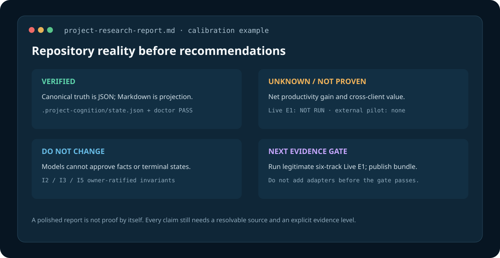

# Case 000 — dsh-researcher self-audit

> **CALIBRATION ONLY — NOT USER EVIDENCE.** This is a review of a real public repository, but it was produced during repository maintenance rather than by an independent user in a certified DSH Researcher session. It does not count toward Live E1, a pilot, E2, adoption, or outcome value.



## Context

- Repository: `TLNing260310/dsh-researcher`
- Reviewed revision: `0aa4a16` (`v0.8.0-alpha.8`) plus the onboarding changes being prepared on `main`
- Review date: 2026-08-25
- Method: source, tests, documentation, GitHub metadata, registry metadata, and offline `npm run check`
- DSH/model execution: none
- Runtime Certificate: not applicable

## Purpose reconstructed

The repository tests whether an AI coding workflow can preserve evidence-typed project reality across sessions and let a host—not the assistant's final prose—decide when a bounded goal is complete. Project Research and Goal Governor are separable layers; the project is not another generic planner, task graph, or Markdown memory system.

## Evidence-graded findings

### VERIFIED — the mechanical implementation is substantial

- `package.json` exposes offline demo, doctor, E1 preflight, scorer, and live-runner entry points.
- `npm run check` passed 238 tests, both doctors, and the six-case offline E1 preflight with zero model and network calls on 2026-08-25.
- `docs/validation-status.md` distinguishes mechanical PASS from Live E1 `NOT RUN` and outcome value `NOT PROVEN`.

Impact: keep the mechanism, installer hardening, and frozen proof order. Do not describe these checks as productivity evidence.

### VERIFIED — truth and completion authority are deliberately separated

- `.project-cognition/state.json` is canonical; `PROJECT_COGNITION.md` is a deterministic projection.
- Session findings require draft → owner review → seal → projection before becoming project facts.
- A goal terminal state is recomputed from the trusted event prefix; assistant text cannot replace it.

Impact: these are the defining invariants. Removing owner promotion or host-owned terminal adjudication would turn the project into a conventional memory/prompt workflow.

### CONTRADICTED — package identity previously implied an unavailable npm route

The repository used the unscoped local name `dsh-researcher`, while that public npm name resolves to another maintainer and repository. The documented GitHub commands were safe, but npm search could lead a user elsewhere.

Action in this onboarding revision: use private scoped package metadata, add an explicit GitHub-only distribution warning, and keep all public install commands pinned to this repository or verified release assets.

### UNKNOWN — net user value

No independent user case has been admitted. Release asset downloads, clone traffic, repository views, or passing fixtures do not show that users maintain software better with this workflow.

Next evidence: legitimate six-track Live E1, then a small non-inferential pilot with tasks that will not be reused in blinded E2.

### UNKNOWN — general client portability

The portable reducer and schemas provide an adapter seam, but only DSH currently exposes the required host authority. Codex, Claude Code, OpenClaw, Kiro, and Zed/Zcode are not delivered integrations.

Next decision: do not build a second adapter before E2 establishes enough incremental Goal Governor value to justify conformance work.

## Build / do not build / investigate

- **BUILD:** a shorter bilingual first impression, exact package identity guidance, visual demonstration, low-friction trial feedback, and public evidence bundles when they exist.
- **DO NOT BUILD:** more generic memory, planning, spec, issue graph, or additional adapters before the evidence gate.
- **INVESTIGATE:** why local Researcher output quality failed despite a SAFE runtime; whether the ceremony prevents false completion often enough to offset its cost.

## Decision impact

This audit changed the next milestone from feature expansion to onboarding and evidence acquisition. It also caused the npm identity warning and scoped private package metadata. It did not upgrade any value claim.

## Reproduction

```bash
npm run check
npm run demo
npm run eval:e1:preflight
```

These commands are offline. They reproduce mechanism evidence only.
